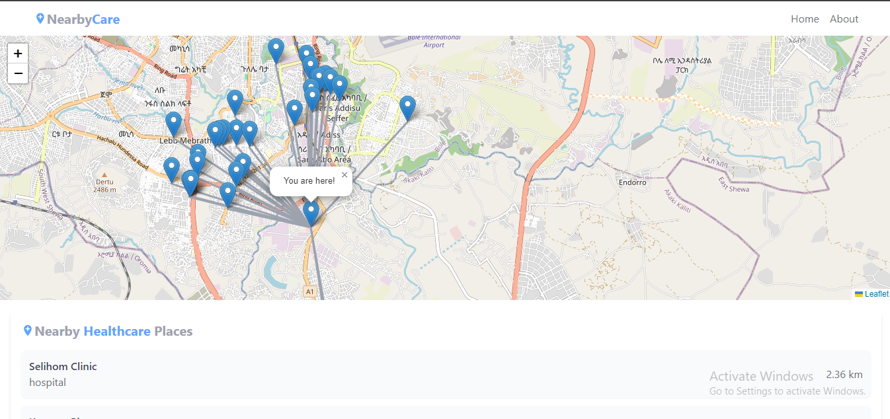

# NearbyCare

NearbyCare is a web application that helps users find nearby healthcare facilities like clinics, pharmacies, hospitals, and more. The app uses your location to fetch nearby healthcare places and calculates the distance from you to those places in either kilometers or meters.

## Usage

1. On the home page, your location will be automatically detected.
2. Healthcare places within a 5km radius will be shown.
3. You can change the distance unit between kilometers and meters.
## Screenshot

> *Example of the app displaying healthcare places nearby with distance in kilometers.*

## Built With

- [React](https://reactjs.org/)
- [Leaflet](https://leafletjs.com/)
- [Axios](https://axios-http.com/)
- [Overpass API](https://overpass-turbo.eu/)

## Author

**Amanuel Solomon**  

